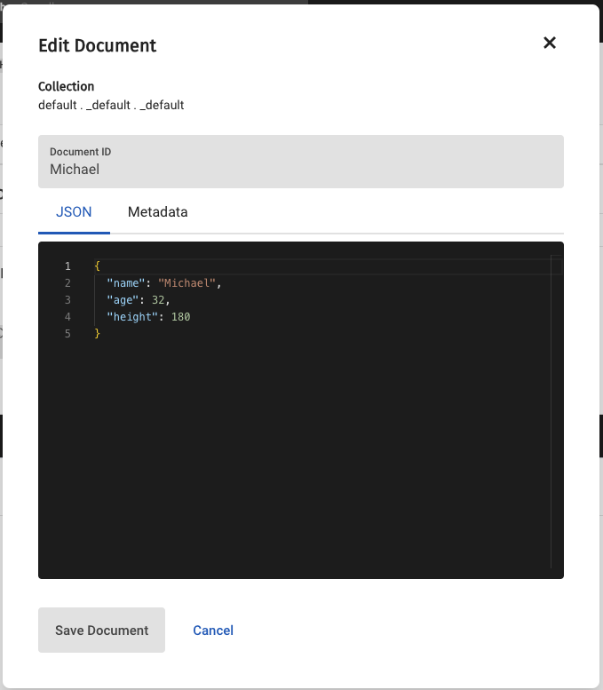

== Introduction

Couchbase Shell is fully featured, so it does not only contain commands related to Couchbase but is actually built on top of a
general purpose shell called https://www.nushell.sh/[Nushell]. This allows you to interact with the file system or any other
command available on your machine, making it a great tool for both operational and development tasks on top of Couchbase.

The following introduction only touches on the basic concepts to make you productive quickly. We recommend also checking out the
great https://www.nushell.sh/book[Nushell documentation] so you can get the most out of it.

=== Navigating the Shell

Commands take inputs and produce output in a structured manner, most often represented as tables. Note how both the generic `ls`
command and the Couchbase-specific `buckets` command both produce a table as their output:

```
> ls
╭────┬─────────────────────┬──────┬───────────┬───────────────╮
│  # │        name         │ type │   size    │   modified    │
├────┼─────────────────────┼──────┼───────────┼───────────────┤
│  0 │ CHANGELOG.md        │ file │   8.7 KiB │ 2 months ago  │
│  1 │ Cargo.lock          │ file │ 194.6 KiB │ a day ago     │
│  2 │ Cargo.toml          │ file │   2.7 KiB │ a day ago     │
│  3 │ Dockerfile          │ file │     590 B │ 2 months ago  │
│  4 │ LICENSE             │ file │  11.1 KiB │ 2 months ago  │
│  5 │ LICENSE_AGREEMENT   │ file │  43.7 KiB │ 2 months ago  │
│  6 │ NOTICES             │ file │ 221.6 KiB │ a week ago    │
│  7 │ README.md           │ file │   9.4 KiB │ 2 months ago  │
│  8 │ build               │ dir  │      64 B │ 4 weeks ago   │
│  9 │ docs                │ dir  │     608 B │ 3 minutes ago │
│ 10 │ examples            │ dir  │     192 B │ 4 months ago  │
│ 11 │ jupyter             │ dir  │     128 B │ 4 months ago  │
│ 12 │ rust-toolchain.toml │ file │     524 B │ 2 weeks ago   │
│ 13 │ src                 │ dir  │     416 B │ a day ago     │
│ 14 │ target              │ dir  │     352 B │ 2 weeks ago   │
│ 15 │ tests               │ dir  │     160 B │ 4 months ago  │
╰────┴─────────────────────┴──────┴───────────┴───────────────╯
```
[options="nowrap"]
```
> buckets
╭───┬─────────┬───────────────┬───────────┬──────────┬──────────────────────┬───────────┬───────────────┬────────┬───────╮
│ # │ cluster │     name      │   type    │ replicas │ min_durability_level │ ram_quota │ flush_enabled │ status │ cloud │
├───┼─────────┼───────────────┼───────────┼──────────┼──────────────────────┼───────────┼───────────────┼────────┼───────┤
│ 0 │ default │ beer-sample   │ couchbase │        1 │ none                 │ 200.0 MiB │ false         │        │ false │
│ 1 │ default │ default       │ couchbase │        2 │ none                 │ 100.0 MiB │ true          │        │ false │
│ 2 │ default │ travel-sample │ couchbase │        2 │ none                 │ 200.0 MiB │ false         │        │ false │
╰───┴─────────┴───────────────┴───────────┴──────────┴──────────────────────┴───────────┴───────────────┴────────┴───────╯
```

You can pipe the output into other commands, for example if you only want to see buckets that have `sample` in their name you
can utilize the `where` command:

[options="nowrap"]
```
> buckets | where name =~ "sample"
╭───┬─────────┬───────────────┬───────────┬──────────┬──────────────────────┬───────────┬───────────────┬────────┬───────╮
│ # │ cluster │     name      │   type    │ replicas │ min_durability_level │ ram_quota │ flush_enabled │ status │ cloud │
├───┼─────────┼───────────────┼───────────┼──────────┼──────────────────────┼───────────┼───────────────┼────────┼───────┤
│ 0 │ default │ beer-sample   │ couchbase │        1 │ none                 │ 200.0 MiB │ false         │        │ false │
│ 1 │ default │ travel-sample │ couchbase │        2 │ none                 │ 200.0 MiB │ false         │        │ false │
╰───┴─────────┴───────────────┴───────────┴──────────┴──────────────────────┴───────────┴───────────────┴────────┴───────╯
```

In a similar fashion you can turn this structured table into other output formats, for example JSON:

```
> buckets | where name =~ "sample" | to json
[
  {
    "cluster": "default",
    "name": "beer-sample",
    "type": "couchbase",
    "replicas": 1,
    "min_durability_level": "none",
    "ram_quota": 209715200,
    "flush_enabled": false,
    "status": "",
    "cloud": false
  },
  {
    "cluster": "default",
    "name": "travel-sample",
    "type": "couchbase",
    "replicas": 2,
    "min_durability_level": "none",
    "ram_quota": 209715200,
    "flush_enabled": false,
    "status": "",
    "cloud": false
  }
]
```

Exactly this type of composition takes the unix philosophy of "do one thing well" and meshes it together with the idea of flexible
structured pipelines. This allows to build powerful compositions that help you in your daily operations with Couchbase, both from
a developer or operations point of view.

=== Getting Help

Other than using this documentation for help, each command can be called with `-h` or `--help` to get information about potential
flags, arguments and subcommands. Also, some commands provide additional examples.

```
> buckets -h
Perform bucket management operations

Usage:
  > buckets {flags}

Subcommands:
  buckets config - Shows the bucket config (low level)
  buckets create - Creates a bucket
  buckets drop - Drops buckets through the HTTP API
  buckets flush - Flushes buckets through the HTTP API
  buckets get - Fetches buckets through the HTTP API
  buckets load-sample - Load a sample bucket
  buckets update - Updates a bucket

Flags:
  -h, --help - Display the help message for this command
  --clusters <String> - the clusters which should be contacted
```

Some commands (like the one above) only act as groupings for subcommands, like `from`, `to` or `doc`. Since they do not serve a
purpose on their own, they will render their help output automatically:

```
> doc
Usage:
  > doc

Subcommands:
  doc get - Fetches a document through the data service
  doc import - Import documents from a file through the data service
  doc insert - Insert a document through the data service
  doc remove - Removes a document through the data service
  doc replace - Replace a document through the data service
  doc upsert - Upsert (insert or override) a document through the data service

Flags:
  -h, --help - Display the help message for this command
```

=== The Prompt explained
Couchbase Shell uses a custom, two line prompt to show you exactly in what environment you are working in right now. Since you
can connect to different clusters, switch buckets etc. it is important to know what is currently "active", as the active buckets/scope/collection
will be what commands are run against. Here is a sample prompt that will greet you when starting the shell:

```
👤 Administrator 🏠 local in 🗄 travel-sample._default._default
>
```

It tells you that your user is `Administrator`, the current active cluster identifier is `local` and the active bucket is `travel-sample`.
The current scope and collection have not been set, so they assume the `_default` value.

If you have an active scope or collection set then the prompt will also update to reflect that:

```
👤 Administrator 🏠 local in 🗄 travel-sample.inventory.landmark
>
```

If we ran a `doc get` it would fetch the doc from travel-sample.inventory.landmark. In the second line, your actual user prompt starts.

=== Loading Data into the Shell

If you want to import data into Couchbase, or just load it into the shell for further processing, there are different commands available to help you.
Once data is loaded into the shell the simplest way to save it to the connected cluster is using the <<_doc_import,doc import>> command.
Alternatively if you want more control over the format and key of the uploaded data you can upload it manually using one of the other Couchbase save commands: `doc upsert` and `doc insert`.

==== Manual import

The `open` command will look at file endings and try to decode it automatically.
Imagine a file named `user.json` in your current directory.

```
> cat user.json
{
  "name": "Michael",
  "age": 32,
  "height": 180
}

> open user.json
╭────────┬─────────╮
│ name   │ Michael │
│ age    │ 32      │
│ height │ 180     │
╰────────┴─────────╯
```

As you can see, the `open` command automatically decoded the JSON document into the tabular format.
If the filename would only be `user`, the import would look like this instead:

```
> open user
{
  "name": "Michael",
  "age": 32,
  "height": 180
}
```

If you are dealing with data that cannot be decoded automatically, you can use the various `from` subcommands to help with decoding.
In our case we use `from json`:

```
> open user | from json
╭────────┬─────────╮
│ name   │ Michael │
│ age    │ 32      │
│ height │ 180     │
╰────────┴─────────╯
```

The `doc upsert` and `doc insert` commands require there to be only two fields/columns.
By default, these two columns are named `id` and `content`, but these can be overridden with `--id-column` and `--content-column`.
The id column will be used as the key for the document, while the content column will be the json stored using that key.
To get `user.json` in a format that can be inserted into the connected Cluster we https://www.nushell.sh/commands/docs/wrap.html[wrap] the entire document into a content column and then https://www.nushell.sh/commands/docs/insert.html[insert] the id that we want to use:

```
> open user.json | wrap content | insert id $in.content.name
╭─────────┬──────────────────────╮
│         │ ╭────────┬─────────╮ │
│ content │ │ name   │ Michael │ │
│         │ │ age    │ 32      │ │
│         │ │ height │ 180     │ │
│         │ ╰────────┴─────────╯ │
│ id      │ Michael              │
╰─────────┴──────────────────────╯
```

There are many other approaches to achieving this same result.
With our data in the correct format we can then upsert:

```
> open user.json | wrap content | insert id $in.content.name | doc upsert
╭───┬───────────┬─────────┬────────┬──────────┬───────────╮
│ # │ processed │ success │ failed │ failures │  cluster  │
├───┼───────────┼─────────┼────────┼──────────┼───────────┤
│ 0 │         1 │       1 │      0 │          │ local     │
╰───┴───────────┴─────────┴────────┴──────────┴───────────╯
```

This results in the following doc being stored in the Cluster:



See the <<_importing_data,Importing data recipes>> for more examples.

=== Exporting Data from the Shell

The export counterparts to `open` and `from`, are `save` and `to`.
You can use both commands to take tabular data from the shell and store it in files of the needed target format.

Like `open`, `save` will try to discern the format from the file ending.
The following example will load a JSON file and then save it as CSV:

```
> cat user.json
{
  "name": "Michael",
  "age": 32,
  "height": 180
}
```

```
> open user.json | save user.csv
```

```
> cat user.csv
name,age,height
Michael,32,180
```

This example is dealing with only one row for simplicity, but you can save as many rows as you need in one file.

As a motivating example, the following snippet runs a N1QL query and stores the result as a csv file:

```
> query "select airportname,city,country from `travel-sample` where type = 'airport' limit 10" | save output.csv
```

```
> cat output.csv
airportname,city,country
Calais Dunkerque,Calais,France
Peronne St Quentin,Peronne,France
Les Loges,Nangis,France
Couterne,Bagnole-de-l'orne,France
Bray,Albert,France
Le Touquet Paris Plage,Le Tourquet,France
Denain,Valenciennes,France
Glisy,Amiens,France
La Garenne,Agen,France
Cazaux,Cazaux,France
```

See the <<_exporting_data,Exporting data recipes>> for more information.
